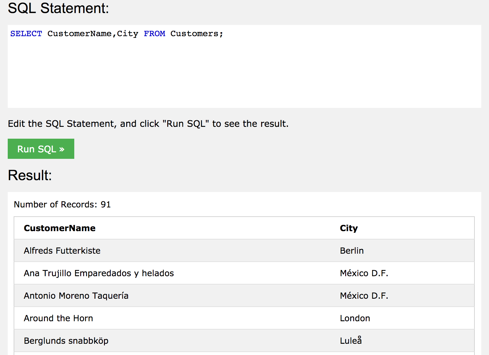
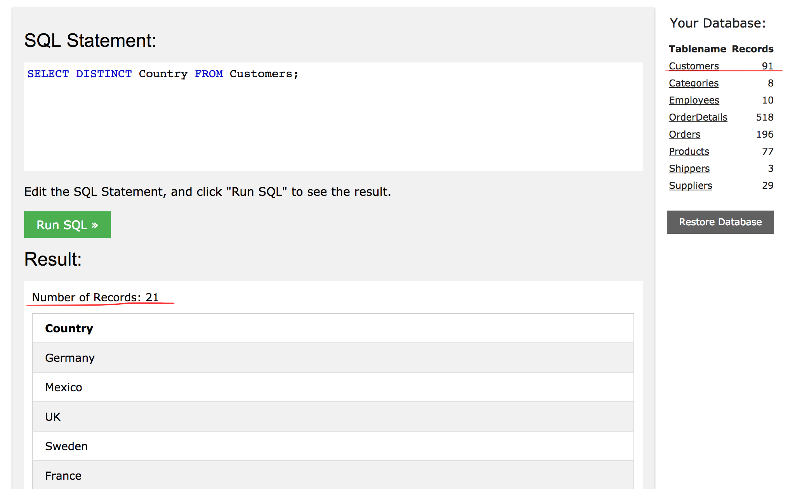
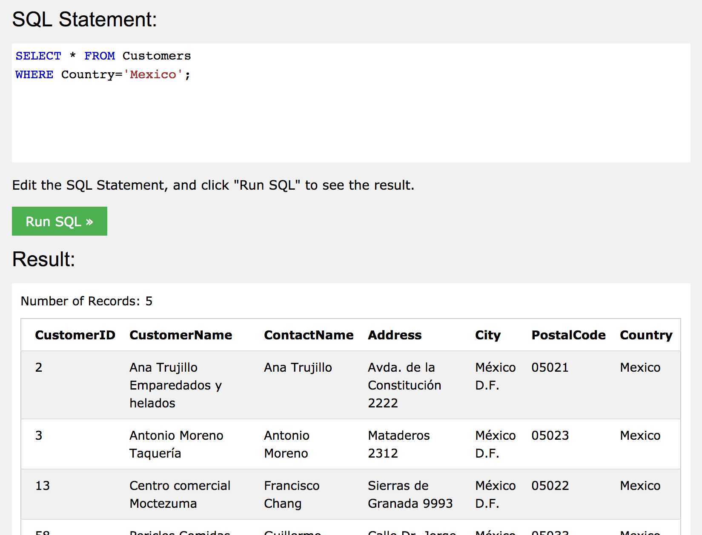
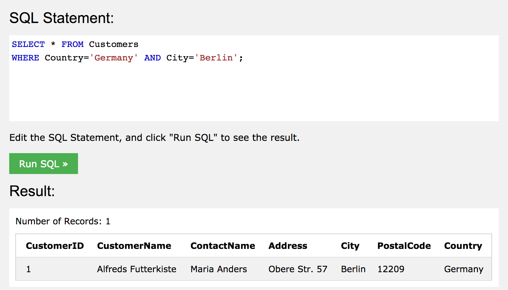
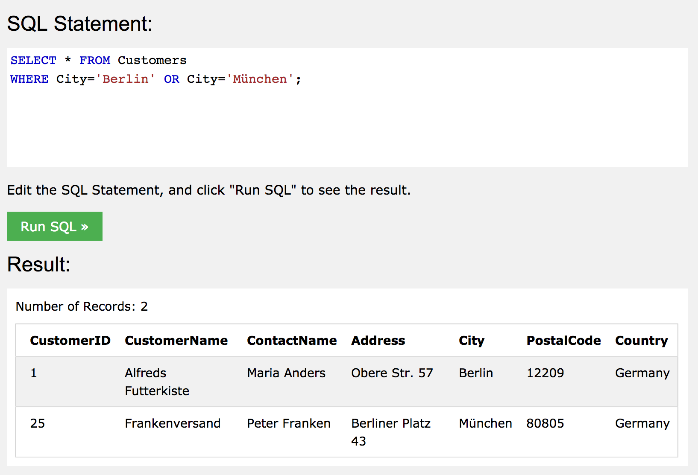
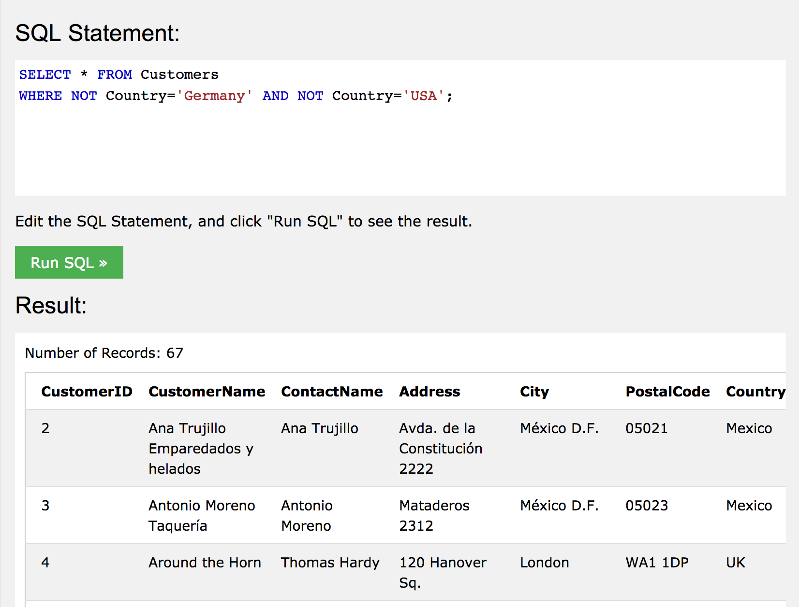
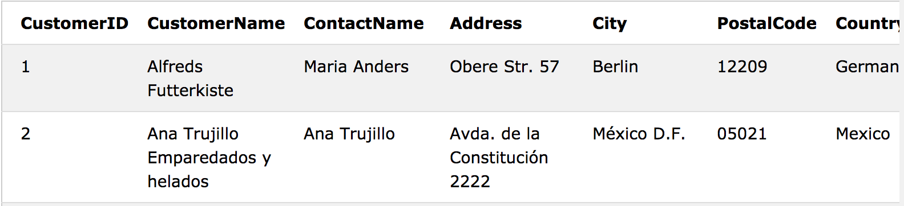
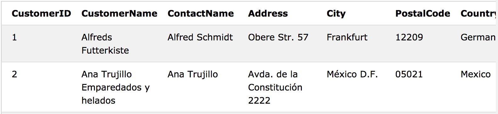

# SQL
> 데이터베이스의 데이터를 저장, 조작 및 검색 하기 위한 표준 언어  

-

>DB, Table, Record, Field란?
>


## SQL로 할 수 있는 것
- DB에 대해 쿼리 실행
- DB 데이터의 검색, 추가, 수정, 삭제 가능
- 새로운 DB 생성 가능
- DB에 테이블, 프로시저 및 뷰 생성 및 사용 권한 설정 가능


## 구문
```sql
SELECT * FROM Customer;
```
위의 예시는 DB에서 Cumtomer 테이블의 모든 요소를 출력하는 명령이다.

SQL은 대문자와 소문자를 구분하지 않는다.  
SELECT와 select 둘 다 동일하게 인식한다.

## 주요 명령어

- SELECT : DB의 데이터를 추출한다.
- UPDATE : DB의 데이터를 수정한다.
- DELECT : DB의 데이터를 삭제한다.
- INSERT INTO : DB에 새로운 데이터를 추가한다.
- CREATE DATABASE : 새로운 DB를 생성한다.
- ALTER DATABASE : DB를 수정한다.
- CREATE TABLE : 새로운 테이블을 생성한다.
- TABLE ALTER : 테이블을 수정한다.
- DROP TABLE : 테이블을 삭제한다.
- CREAT INDEX : 색인을 생성한다.
- DROP INDEX : 색인을 삭제한다.

-

### SELECT
SELECT는 데이터를 선택하는 데 사용한다.  
선택된 데이터는 결과 세트라고 하는 테이블에 저장된다.

```sql
SELECT column1, colum2, ...
FROM table_name;
```
SELECT 뒤에 오는 column1, column2,...는 선택할 테이블 필드의 이름이다.

모든 필드를 선택하기 위해선 아래의 구문을 사용한다

```sql
SELECT * FROM table_name;
```
테이블 필드의 이름 대신 사용된 `*`는 `all`을 뜻한다.


Customer 테이블에서 CustomerName과 City열을 선택한 예시이다.

-

### DISTINT
```sql
SELECT DISTICT column1, column2,...
FROM table_name;
```
선택한 데이터에서 중복되지 않은 정보만 추려서 보여준다.  
(Python에서 set을 생각하면 될 것 같다.)

```sql
SELECT DISTINCT City FROM Customers;
```

오른쪽 전체 데이터베이스의 테이블의 Customer의 레코드는 91이지만, 중복되지 않은 Country는 21개 임을 알 수 있다.

-

### WHERE clause
```sql
SELECT column1, column2, ...
FROM table_name
WHERE condition;
```
조건을 만족하는 특정 레코드만 필터링 하는데 사용한다.

```sql
SELECT * FROM Customers
WHERE Country='Mexico';
```


Customers 테이블에서, Contry의 레코드가 Mexico인 Customer를 모두 선택한다.

>WHERE는 SELECT 외에, UPDATE나 DELETE에도 사용된다.

-

### WHERE 연산자
아래의 연산자는 WHERE 절에서 사용이 가능하다.

 Operator|Description
 ---|---
 `=`		|Equal
 `<>`		|Not equal. **Note:** In some versions of SQL this operator may be written as `!=`
 `>`       |Greater than
 `<`		|Less than
 `>=`      |Greater than or equal
 `<=`		|Less than or equal
 `BETWEEN`	|Between an inclusive range
 `LIKE`	|Search for a pattern
 `IN`		|To specify multiple possible values for a column  


-

 
### AND, OR and NOT
WHERE 절에서 AND, OR 및 NOT을 사용해, 조건을 조합하여 필터링 할 수 있다.

- AND를 사용하면 모든 조건에 부합하는 레코드를 출력
- OR를 사용하면 조건 중 하나 이상이 부합하는 레코드를 출력
- NOT은 조건을 부합하지 않는 레코드를 출력

```sql
SELECT * FROM Customers
WHERE Country='Germany' AND City='Berlin';
```


Country=Germany, City=Berlin  
**두 조건을 모두 만족(AND)**한 Customer의 모든 레코드를 출력

```sql
SELECT * FROM Customers
WHERE City='Berlin' OR City='München';
```


City=Berlin, City= München  
두 조건 중 **하나 이상을 만족(OR)**하는 Customer의 모든 레코드를 출력

```sql
SELECT * FROM Customers
WHERE NOT Country='Germany' AND NOT Country='USA';
```


Country= Germany, Country = München  
**두 조건 모두(AND) 만족하지 않는(NOT)** Customer의 모든 레코드를 출력

-

### ORDER BY KEYWORD

```sql
SELECT column_name, column_name
FROM table_name
ORDER BY column1 ASC|DESC, column2 ASC|DESC;
```
특정 컬럼을 기준으로 레코드를 오름차순, 또는 내림차순으로 레코드를 정렬한다.  

```sql
SELECT * FROM Customers
ORDER BY Country;
```
column의 이름만 입력한 경우 기본값인 오름차순으로 정렬이 된다.


```sql
SELECT * FROM Customers
ORDER BY Country DESC;
```
DESC를 명시한 경우, 해당 column을 기준으로 내림차순 정렬이 된다.


```sql
SELECT * FROM Customers
ORDER BY Country ASC, CustomerName DESC;
```

복합적으로 사용할 경우 앞에 명시된 column에 대해 먼저 정렬이 된다.

1. Country를 기준으로 레코드가 오름차순으로 정렬된다.  
2. CustomerName을 기준으로, **Country가 같은 레코드 끼리** 내림차순으로 정렬된다.

-

### INSERT INTO
새로운 레코드를 테이블에 추가한다.

```sql
INSERT INTO table_name (column1, column2, column3, ...)
VALUES (value1, value2, value3, ...);
```
column name과 value를 지정해서 추가하는 방법이다.  
**Column 내용을 모두 채우지 않을 경우, null 값이 부여된다.**

>Null 값은, 0이나 공백을 가지는 필드와는 다르다.  
>Null 값은 레코드가 생성될 때 비어있던 값이라는 것을 나타낸다.  
>NULL값은 =,<,>등의 연산자로는 판단이 불가능하다.  
>IS NULL 또는 IS NOT NULL을 사용해서 NULL값을 가지는지, 가지지않는지 판단할 수 있다.

<br>

```sql
INSERT INTO table_name;
VALUE (value1, value2, valu3, ...);
```
table name만 명시한 경우, 입력할 레코드의 value 값을 순차적으로 모두 입력하여 추가한다.

```sql
INSERT INTO Customers (CustomerName, ContactName, Address, City, PostalCode, Country)
VALUES ('Cardinal', 'Tom B. Erichsen', 'Skagen 21', 'Stavanger', '4006', 'Norway');
```
>CustomerID column은 자동 증가 필드로, 새로운 레코드를 테이블에 삽입할 경우 자동으로 생성된다.  
>(입력하지 않아도, 자동으로 생성된다.)

-

### UPDATE
기존에 입력된 데이터를 수정한다.

```sql
UPDATE table_name
SET column1 = valu1, colimn2 = value2, ...
WHERE conditon;
```
>WHERE절을 사용해 수정(UPDATE)할 레코드를 지정해야 한다.

UPDATE 전 Customer 테이블


```sql
UPDATE Customers
SET ContactName = 'Alfred Schmidt', City= 'Frankfurt'
WHERE CustomerID = 1;
```

UPDATE 후 Customer 테이블


WHERE를 이용해 CustomerID=1 로 필터링 된 레코드에서 ContactName과 City 필드를 입력한 정보로 업데이트 하였다.
>WHERE를 사용하지 않으면 해당 column의 전체 데이터가 수정되기 때문에, 전체를 바꿀 경우가 아니면 반드시 입력해야한다.

-


### DELETE
```sql
DELETE FROM table_name
WHERE condition;
```
테이블에 기존 레코드를 삭제하는데 사용한다.
>WHERE를 사용하지 않으면 테이블 전체의 레코드가 삭제된다.

<br>

```sql
DELETE FROM Customers
WHERE CustomerName='Alfreds Futterkiste'
```
Customers 테이블에서, CustomerName이 Alfreds Futterkiste인 레코드를 삭제한다.

-
