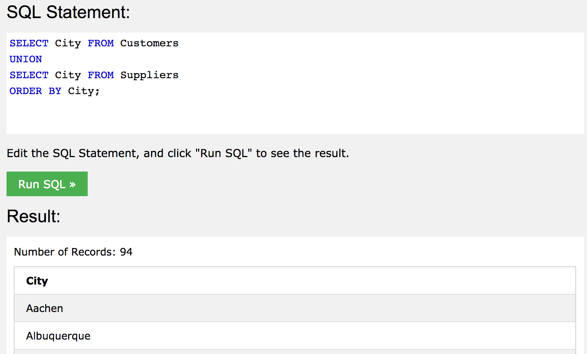

# SQL

## 주요 명령어

### SELECT TOP

```sql
SELECT TOP number|percent column_name(s)
FROM table_name
WHERE condition;
```
특정 개수(number) 혹은 전체 데이터에서의 비율(percent)로 출력할 레코드의 개수를 선택할 수 있다.  

```sql
SELECT TOP 3 * FROM Customers;
```
위의 예시는 Customers 테이블에서 3번째 레코드까지 출력한다.

```
SELECT TOP 50 PERCENT * FROM Customers;
```
Customers 테이블에서 전체 레코드의 50%를 출력한다.

```
SELECT TOP 3 * FROM Customers
WHERE Country='Germany';
```
Customers 테이블에서, Country column의 필드값이 Germany인 레코드 중 3번째 레코드까지 출력한다.
 
>`LIMIT`과 `ROWNUM`을 사용하여 동일한 결과를 출력할 수 있다.
>
>```
>SELECT * FROM Customers
>WHERE Country='Germany'
>LIMIT 3;
>```
>
>```
>SELECT * FROM Customers
>WHERE Country='Germany' AND ROWNUM <= 3;
>```

### MIN() & MAX()
MIN()은 선택된 column의 가장 작은 값을 반환한다.
MAX()는 선택된 column의 가장 큰 값을 반환한다.

```sql
SELECT MIN(column_name)
FROM table_name
WHERE condition;
```

```sql
SELECT MAX(column_name)
FROM table_name
WHERE condition;
```


Product 테이블에서 Price column에 MIN()과 MAX()를 사용해본다.

```sql
SELECT MIN(Price) AS SmallestPrice
FROM Products;
```


```sql
SELECT MAX(Price) AS LargestPrice
FROM Products;
```


Price값에서 가장 작은 값과 큰 값이 반환되었다.

### COUNT(), AVG(), SUM()
COUNT()는 지정한 조건과 일치하는 ROW의 수를 반환한다.

```sql
SELECT COUNT(column_name)
FROM table_name
WHERE condition;
```

AVG()는 숫자 column의 평균값을 반환한다.

```sql
SELECT AVG(column_name)
FROM table_name
WHERE condition;
```

SUM()은 숫자 column의 총 합계를 반환한다.

```sql
SELECT SUM(column_name)
FROM table_name
WHERE condition;
```

### LIKE Operator & Wildcard
LIKE operator는 특정 문자열을 포함한 레코드를 찾을 때 사용한다.

```sql
SELECT column_name(s)
FROM table_name
WHERE column_name LIKE pattern;
```

- LIKE에서 사용되는 2개의 와일드카드

	- `%` : 백분율 기호는 0,1 또는 복수의 문자를 나타낸다.
	- `_` : 밑줄은 한 개의 문자를 나타낸다.

- [charlist] 와일드카드
	- [charlist] : 일치시킬 문자들의 세트를 정의할 수 있다.
	- [^charlist] 또는 [!charlist] : 일치하지 않는 문자들의 세트를 정의할 수 있다.


LIKE Operator|Description
---|---
WHERE CustomerName LIKE `a%`   | Finds any values that starts with "a"
WHERE CustomerName LIKE `%a`   | Finds any values that ends with "a"
WHERE CustomerName LIKE `%or%` | Finds any values that have "or" in any position
WHERE CustomerName LIKE `_r%`  | Finds any values that have "r" in the second position
WHERE CustomerName LIKE `a_%_%`| Finds any values that starts with "a" and are at least 3 characters in length
WHERE ContactName LIKE `a%o`   | Finds any values that starts with "a" and ends with "o"

<br>

- '%'와 '_'를 사용한 예시

	```sql
	SELECT * FROM Customers
	WHERE CustomerName LIKE 'a%';
	```
	위 예문은 CustomerName이 "a"로 시작하는 모든 고객을 선택한다.

	```sql
	SELECT * FROM Customers
	WHERE CustomerName LIKE '%a';
	```
	위 예문은 CustomerName이 "a"로 끝나는 모든 고객을 선택한다.

	```sql
	SELECT * FROM Customers
	WHERE CustomerName NOT LIKE 'a%';
	```
	위 예문은 CustomterName이 "a"로 시작하지 	않는 모든 고객을 선택한다.

<br>

- [charlist], [!charlist]를 사용한 예시
	
	```sql
	SELECT * FROM Customers
	WHERE City LIKE '[bsp]%';
	```
	위 예시는 City가 "b"나 "s" 또는 "p"로 시작하는 모든 고객을 선택한다.
	
	```sql
	SELECT * FROM Customers
	WHERE City LIKE '[a-c]%';
	```
	위 예시는 City가 "a"나 "b" 또는 "c"로 시작하는 모든 고객을 선택한다.
	
	```sql
	SELECT * FROM Customers
	WHERE City LIKE '[!bsp]%';
	```
	위 예시는 City가 "b"나 "s" 또는 "p"로 시작하지 <b>않는</b> 모든 고객을 선택한다.
	
>[charlist]와 NOT을 조합하여 [!charlist]같은 기능을 하게 만들 수 있다.
>
>```
>SELECT * FROM Customers
>WHERE City NOT LIKE '[bsp]%';
>```

### IN Operator
IN을 사용하면, WHERE 절에 여러 값을 지정할 수 있다. (여러번 OR를 쓰는 대신 IN 한번으로 줄일 수 있음)

```sql
SELECT column_name(s)
FROM table_name
WHERE column_name IN (value1, valu2, ...);
```
또는

```sql
SELECT column_name(s)
FROM table_name
WHERE column_name IN (SELECT STATEMENT);
```

```sql
#1
SELECT * FROM Customers
WHERE Country IN ('Germany', 'France', 'UK');

#2
SELECT * FROM Customers
WHERE Country='Germany' OR Country='France' OR Country='UK';
```
위 예문에서 1번과 2번은 동일하게 Contry가 Germany, France 혹은 UK인 모든 데이터를 출력한다.

```sql
SELECT * FROM Customers
WHERE Country IN (SELECT Country FROM Suppliers);
```
위 예문은 Suppliers의 Contry와 Customer의 Contry가 일치하는 모든 데이터를 출력한다.

### BETWEEN Operator
BETWEEN은 주어진 범위 내의 값을 선택한다.  
값은 숫자, 텍스트 혹은 날짜를 사용할 수 있다.  

```sql
SELECT column_name(s)
FROM table_name
WHERE column)name BETWEEN value1 AND value2;
```
특정 Column에서 value1과 value2 사이에 해당하는 데이터를 가진 모든 정보를 출력한다.

```sql
SELECT * FROM Products
WHERE Price BETWEEN 10 AND 20;
```
위의 예문은 Product 테이블의 Price column에서 value가 10~20인 데이터의 모든 정보를 출력한다.


```sql
SELECT * FROM Products
WHERE ProductName BETWEEN 'Carnarvon Tigers' AND 'Mozzarella di Giovanni'
ORDER BY ProductName;
```
위의 예문은 ProductName이 Carnarvon Tigers와 Mozzarella di Giovanni 사이에 있는 모든 제품의 정보를 출력한다.

### Aliases
Aliases는 table 또는 column에 임시로 이름을 붙여주는 데 사용된다.
별명은 쿼리가 사용 중일때만 존재한다.

```sql
SELECT column_name AS alias_name
FROM table_name;
```
위의 예문은 column에 별칭을 붙인다.

```sql
SELECT column_name(s)
FROM table_name AS alias_name;
```
위의 예문은 table에 별칭을 붙인다.

```sql
SELECT CustomerName AS Customer, ContactName AS [Contact Person]
FROM Customers;
```
CustomerName은 Customer, ContactName은 Contact Person이라는 별칭을 붙여서 출력된다.
>별칭에 공백이 포함되어 있으면 "" 또는 []가 필요하다.

```sql
SELECT CustomerName, Address + ', ' + PostalCode + ' ' + City + ', ' + Country AS Address
FROM Customers;
```
위의 예문은 Address, PostalCode, City를 결합한 "Address"라는 별칭을 가진 데이터를 출력한다.

별칭이 유용한 경우

- 쿼리문에 두 개 이상의 테이블이 관련되어 있는 경우
- 쿼리문에 함수가 사용될 경우
- column 이름이 너무 길거나 읽기 힘든 경우
- 두 개 이상의 column이 합쳐지는 경우

### JOIN
두 개 이상의 테이블에서 행을 결합하는데 사용한다.

JOIN의 유형

- (INNER) JOIN
- LEFT(OUTER) JOIN
- RIGHT (OUTER) JOIN
- FULL (OUTER) JOIN

### INNER JOIN


```sql
SELECT column_name(s)
FROM table1
INNER JOIN table2
ON table1.column_name = tabel2.column_name;
```
두 테이블에서 값이 일치하는 데이터를 반환한다.

>INNER JOIN과 JOIN 둘 중 어느걸 써도 상관없다.

```sql
SELECT Orders.OrderID, Customers.CustomerName
FROM Orders
INNER JOIN Customers ON Orders.CustomerID = Customers.CustomerID;
```

위의 예시는 각 테이블의 CustomerID가 일치하는, Order table의 OrderID column과 Customers table의 CustomerName column을 반환한다.

```sql
SELECT Orders.OrderID, Customers.CustomerName, Shippers.ShipperName
FROM ((Orders
INNER JOIN Customers ON Orders.CustomerID = Customers.CustomerID)
INNER JOIN Shippers ON Orders.ShipperID = Shippers.ShipperID);
```
위의 예시는 3개의 테이블을 JOIN한 예시이다.

1. Orders table의 CustomerID와 Customers table의 CustomerID가 일치하는 Orders의 레코드를 뽑아낸다
2. 그 레코드 중에서, 다시 한번 Orders의 ShipperID와 Shippers table의 ShipperID가 일치하는 레코드만 뽑아낸다.
3. 마지막에 필터링 된 레코드에서 OrderID, CustomerID, ShipperName column을 선택해 반환한다.

>말로 보면 어려운데 집합에서 교집합이라고 생각하자;;


### LEFT JOIN


```sql
SELECT column_name(s)
FROM table1
LEFT JOIN table2 ON table1.column_name = table2.column_name;
```
왼쪽 테이블에서 모든 레코드를 반환하고 오른쪽 테이블에서 일치하는 데이터를 반환한다.  
만약 일치하는 것이 없으면 오른쪽 테이블에서 반환될 데이터는 NULL이 된다.

```sql
SELECT Customers.CustomerName, Orders.OrderID
FROM Customers
LEFT JOIN Orders ON Customers.CustomerID = Orders.CustomerID
ORDER BY Customers.CustomerName;
```
Customers의 모든 CustomerName 데이터를 반환하고, Customers table의 CustomerID와 Orders table의 CustomerID가 일치하는 레코드에서 OrderID 데이터를 반환한다.
만약, CustomerID가 일치하지 않는 경우, CustomerName과 함께 반환될 OrderID의 값은 NULL로 표시된다.


### RIGHT JOIN
오른쪽 테이블에서 모든 레코드를 반환하고 왼쪽 테이블에서 일치하는 레코드를 반환한다.


위의 경우와 반대이다. FROM에 온 table은 조건이 일치하는 데이터만 반환하고, RIGHT JOIN 뒤에 명시된 table은 선택된 모든 데이터를 반환한다.

### FULL JOIN
왼쪽 또는 오른쪽 테이블에 일치하는 레코드를 반환한다.


두 테이블 모두 반환되며, 조건이 일치하지 않는 경우에는 NULL값이 반환된다. 


(빨간 빈칸이 조건이 일치하지 않아 NULL로 반환된 데이터들이다.)

### SELF JOIN
하나의 테이블 안에서 조건을 만족하는 데이터를 반환할 때 사용한다.

```sql
SELECT column_name(s)
FROM table1 T1, table1 T2
WHERE condition;
```

>table1을 각각 T1, T2로 명시한 다음 JOIN한다.


```sql
SELECT A.CustomerName AS CustomerName1, B.CustomerName AS CustomerName2, A.City
FROM Customers A, Customers B
WHERE A.CustomerID <> B.CustomerID
AND A.City = B.City 
ORDER BY A.City;
```
위의 예제는 Customers table에서 City가 일치하고 CustomerID가 다른 CustomerName을 반환한다.


### UNION Operator

UNION Operator는 두 개 이상의 쿼리문을 합쳐서 보여준다.  
중복되는 값은 기본적으로 하나로 처리한다.
SELECT 문의 열은 동일한 순서로 있어야 한다.

* UNION

	```sql
	SELECT column_name(s) FROM table1
	UNION
	SELECT column_name(s) FROM table2;
	```
	
	

* UNION ALL  
	

	```sql
	SELECT column_name(s) FROM table1
	UNION ALL
	SELECT column_name(s) FROM table2;
	```
	
	
	
	>UNION ALL은 중복되는 값을 하나로 처리하지 않을때 사용한다.

같은 조건으로 UNION과 UNION ALL을 사용한 결과, UNION은 94개의 데이터가 나왔고, UNION ALL은 120개의 데이터가 나왔다.  
(중복 데이터 26개)

### UNION with WHERE

```sql
SELECT City, Country FROM Customers
WHERE Country='Germany'
UNION|UNION ALL
SELECT City, Country FROM Suppliers
WHERE Country='Germany'
ORDER BY City;
```

UNION 연산자에 WHERE문으로 조건을 추가할 수 있다.
위의 예시에서는 Country가 Germany인 레코드의 데이터만 출력된다.

### GROUP BY

```sql
SELECT column_name(s)
FROM table_name
WHERE condition
GROUP BY column_name(s)
ORDER BY column_name(s);
```
GROUP BY 문은 집계 함수(COUNT, MAX, MIN, SUM, AVG)와 함께 사용되어 결과 집할을 하나 이상의 열로 그룹화 한다.


```sql
SELECT COUNT(CustomerID), Country
FROM Customers
GROUP BY Country;
```
위의 예시는 Customers table의 CustomerID를 Country로 묶어서 집계한다.


```sql
SELECT Shippers.ShipperName, COUNT(Orders.OrderID) AS NumberOfOrders FROM Orders
LEFT JOIN Shippers ON Orders.ShipperID = Shippers.ShipperID
GROUP BY ShipperName;
```
위의 예시는 GROUP BY에 JOIN을 사용하여 각 Shipper가 받은 주문의 수를 반환한다.


### HAVING Clauses

```sql
SELECT column_name(s)
FROM table_name
WHERE condition
GROUP BY column_name(s)
HAVING condition
ORDER BY column_name(s);
```
WHERE 키워드를 집계 함수와 사용할 수 없어서 HAVING 절이 추가되었다.

```sql
SELECT COUNT(CustomerID), Country
FROM Customers
GROUP BY Country
HAVING COUNT(CustomerID) > 5;
```
위의 예시는 CustomerID를 5개 이상 보유한 Country만 나열한다

```sql
SELECT Employees.LastName, COUNT(Orders.OrderID) AS NumberOfOrders
FROM Orders
INNER JOIN Employees ON Orders.EmployeeID = Employees.EmployeeID
WHERE LastName = 'Davolio' OR LastName = 'Fuller'
GROUP BY LastName
HAVING COUNT(Orders.OrderID) > 25;
```
위의 예시는 OrderID를 25개 이상 보유한 Employees 중, Davolio나 Fuller 성을 가진 데이터만 반환한다.

### EXIST

```sql
SELECT column_name(s)
FROM table_name
WHERE EXISTS
(SELECT column_name FROM table_name WHERE condition);
```

EXIST는 하위 쿼리의 레코드 존재 여부를 테스트 하는데 사용된다.  
하위 쿼리가 하나 이상의 레코드를 반환하면 true를 반환한다.

```sql
SELECT SupplierName
FROM Suppliers
WHERE EXISTS (SELECT ProductName FROM Products WHERE SupplierId = Suppliers.supplierId AND Price < 20);
```

위의 예시는 Products table의 SupplierId와 Suppliers table의 supplierId가 같은 Products column의 데이터 중, 가격이 20미만인 데이터가 존재할 경우 그 데이터를 반환한다.

### ANY & ALL

```sql
SELECT column_name(s)
FROM table_name
WHERE column_name operator ANY|ALL
(SELECT column_name FROM table_name WHERE condition);
```

ANY와 ALL 연산자는 WHERE 또는 HAVING 절과 함께 사용한다.

>operator 자리에는 표준 연산자(=, <>, !=, >, >=, <, <=)가 들어가야한다.

<br>

```sql
SELECT ProductName
FROM Products
WHERE ProductID = ANY (SELECT ProductID FROM OrderDetails WHERE Quantity = 10);
```
위의 예시는 OrderDetails table에서 quantity=10인 ProductID가 Products table의 ProductID와 일치하는 ProductName 데이터를 반환한다.

```sql
SELECT ProductName
FROM Products
WHERE ProductID = ALL (SELECT ProductID FROM OrderDetails WHERE Quantity = 10);
```
위의 예시는 DrderDetails table의 모든 Quantity가 10인 경우에 ProductID가 Producs table의 ProductID가 일치하는 ProductName 데이터를 반환한다.

>모든 하위 쿼리 값이 조건을 충족해야한다!!


### SELECT INTO
한 테이블의 데이터를 새 테이블 또는 다른 데이터베이스의 테이블로 복사한다.

* 모든 열을 새 테이블로 복사
	
	```sql
	SELECT *
	INTO newtable [IN externaldb]
	FROM oldtable
	WHERE condition;
	```
* 일부 열만 새 테이블로 복사

	```sql
	SELECT column1, column2, column3, ...
	INTO newtable [IN externaldb]
	FROM oldtable
	WHERE condition;
	```

새 테이블은 이전 테이블에 정의된 column name과 유형으로 작성된다.  
AS 절을 사용하여 새 column name을 만들 수 있다.

```sql
SELECT * INTO CustomersBackup2017
FROM Customers;
```
위의 예시는 Customers table의 모든 레코드를 CustomersBackup2017이란 table 이름으로 복사본을 만든다.

```sql
SELECT * INTO CustomersBackup2017 IN 'Backup.mdb'
FROM Customers;
```
위의 예시는 IN을 사용하여 Backup.mdb라는 이름의 데이터베이스에 테이블을 복사한다.

```sql
SELECT Customers.CustomerName, Orders.OrderID
INTO CustomersOrderBackup2017
FROM Customers
LEFT JOIN Orders ON Customers.CustomerID = Orders.CustomerID;
```
위의 예시는 둘 이상의 테이블의 데이터를 새 테이블로 복사한다.

>SELECT INTO를 사용하여 다른 테이블의 스키마를 빈 테이블을 작성 할 수 있다.
>
>```sql
>SELECT * INTO newtable
>FROM oldtable
>WHERE 1=0;
>```

### INSERT INTO SELECT
INSERT INTO SELECT문은 한 테이블의 데이터를 복사하여 다른 테이블에 삽입한다.
 
1. INSERT INTO SELECT는 데이터를 복사할 테이블과 삽입될 테이블의 유형이 일치해야한다.
2. 데이터가 삽입되는 테이블의 기존 레코드는 영향을 받지 않는다.

* 한 테이블의 모든 열을 다른 테이블로 복사

	```sql
	INSERT INTO table2
	SELECT * FROM table1
	WHERE condition;
	```
	
* 한 테이블의 일부 열만 다른 테이블로 복사

	```sql
	INSERT INTO table2 (column1, column2, column3, ...)
	SELECT column1, column2, column3, ...
	FROM table1
	WHERE condition;
	```
<br>	
	
```sql
INSERT INTO Customers (CustomerName, City, Country)
SELECT SupplierName, City, Country FROM Suppliers;
```
위의 예시는 Suppliers table의 SupplierName, City, Country column의 데이터를 Customers table의 CustomerName, CIty, Country column으로 복사한다.

```sql
INSERT INTO Customers (CustomerName, City, Country)
SELECT SupplierName, City, Country FROM Suppliers
WHERE Country='Germany';
```

위의 예시는 Country가 Germany인 경우에만 column을 복사한다.

### Comment
주석은 SQL문의 섹션을 설명하거나, SQL문의 실행을 막을 때 사용한다.

* 한 줄 주석
	
	```sql
	--Select all:
	SELECT * FROM Customers;
	```
	한 줄 주석은 `-`로 시작한다.
	`-`와 행 끝 사이의 텍스트는 무시된다. (실행되지 않음)

	```sql
	SELECT * FROM Customers -- WHERE City='Berlin';
	```
	
* 여러 줄 주석
	
	```sql
	/*Select all the columns
	of all the records
	in the Customers table:*/
	SELECT * FROM Customers;
	```
	여러 줄 주석은 `/*`로 시작하고 `*/`로 끝난다.
	`/*`와 `*/` 사이의 모든 텍스트는 무시된다.
	
	```sql
	/*SELECT * FROM Customers;
	SELECT * FROM Products;
	SELECT * FROM Orders;
	SELECT * FROM Categories;*/
	SELECT * FROM Suppliers;
	```

	```sql
	SELECT CustomerName, /*City,*/ Country FROM Customers;
	```
	